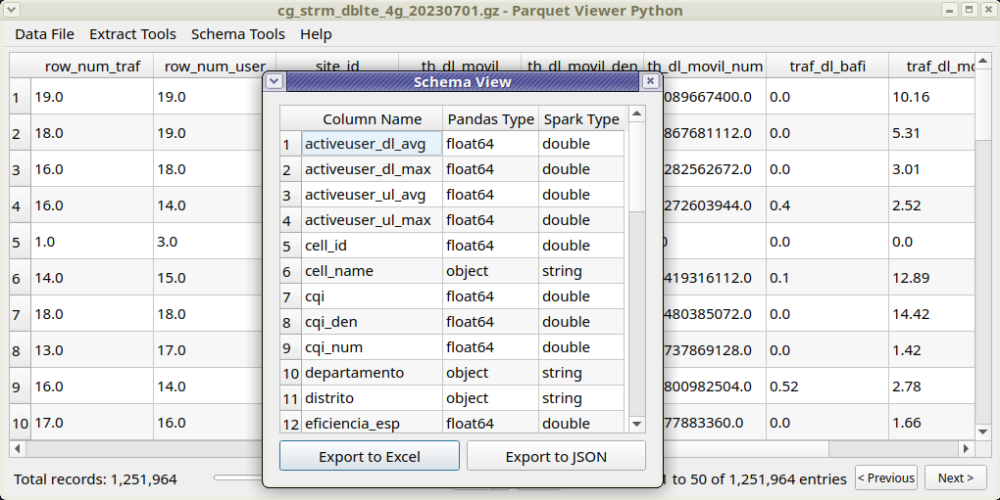

# Parquet Viewer Python

A desktop utility for data engineers and analysts to efficiently explore data lake files, analyze and compare schemas, and convert/export data to various formats—all from your local machine.


## Features
**Version 1.0.0**  
This initial release provides the following capabilities:
- **File Exploration**: Open and visualize Parquet and Gzip (CSV/TXT) files to inspect data content and structure.
- **Data Export**: Export data samples in Gzip or Parquet formats, ideal for extracting the first or last records for further analysis.
- **Schema Management**: View data schemas, export them to Excel or JSON, and compare two JSON schemas—perfect for tables with hundreds or thousands of columns to identify differences.




## Installation

### Prerequisites
- Python 3.x installed on your system.
- Basic familiarity with command-line interfaces.

### Option 1: Add Dependencies to an Existing Environment
Install the required libraries by running:
```bash
pip install -r requirements.txt
```

### Option 2: Create a Dedicated Python Virtual Environment
Run the provided `setup.py` script to set up a virtual environment and install dependencies automatically:
1. Ensure Python 3 is installed.
2. Execute the following command:
   ```bash
   python setup.py
   ```
   This will:
   - Create a virtual environment in the `venv/` folder within the project directory.
   - Install all dependencies listed in `requirements.txt`.
   - Generate a launcher script (`.bat` for Windows or `.sh` for Unix-based systems) for easy application startup.

## Usage
To launch the application: simply double-click run.bat or run.sh.


Or run it manually:
1. Activate the virtual environment (if using Option 2):
   - On Windows: `venv\Scripts\activate`
   - On Unix/Linux/Mac: `source venv/bin/activate`
2. Run the main script:
   ```bash
   python main.py
   ```
3. Follow the on-screen instructions to explore files, export data, or compare schemas.

## Contributing
Contributions are welcome! Please submit issues or pull requests to help improve the project. For major changes, please open an issue first to discuss your ideas.

## About us
WebSite: https://dataengi.net  
Github: https://github.com/edronald7

## License
[MIT License](LICENSE)  
See the `LICENSE` file in the repository for details.